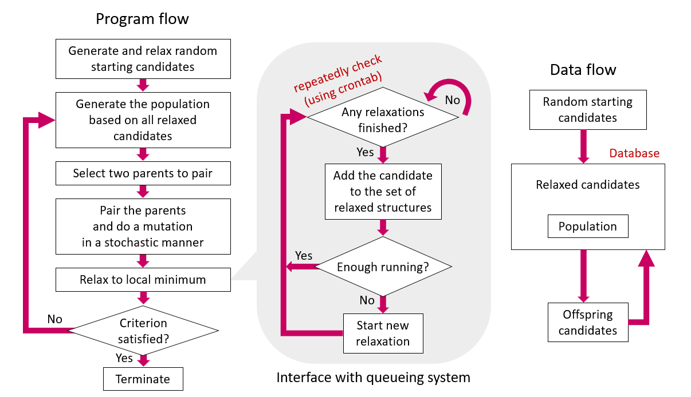

# GA4Qsys
Density functional theory (DFT)-based Genetic algorithm (GA) code for structural optimization of supported nanoparticle model in a queueing system. This code is strongly based on atomic simulation environment (ASE) python module. 

**Features**:

- A criterion that terminates the GA if no new candidate to fill population appears for N<sub>patience</sub>  iterations was newly included.
- Issue of overwriting existing inputs for calculator (e.g., `INCAR`, `KPOINTS`, `POSCAR`, etc. for VASP) was resolved by generating the directory corresponding to each relaxation.

The flow of the code and data, and the crontab-based repeated interaction with a queueing system were shown in the following image.

  

The flowchart above was re-designed based on the figures in the original paper for the GA code implemented in the ASE module [*J. Chem. Phys.* **2014**, 141, 044711].

## How to use
[link to codes](essential_codes/)
1. Prepare essential codes for the calculation in the same directory:   

   `calc.py`, `ga_init.py`, `ga_main_queue.py`, `POSCAR` (to be used as support) 

2. Set computational parameters (e.g., for VASP) in the `calc.py` file.

3. Generate initial random supported metal structures for initial population using `ga_init.py` code. Detailed settings for the generation can be defined in the code.

4. Run the code, `ga_main_queue.py` periodically using tools like *crontab*. Detailed parameters for the GA, such as termination criterion, maximum number of calculations in the queue, and population size, can be set in the code: 
   ```
   # Parameters to be defined by a user -----------------------------------------
   directory_name       = 'Pd8_CeO2_111_GA' # for termination of crontab
   job_prefix           = 'Pd8-CeO2_111_opt' # for job names
   n_converge           = 70
   population_size      = 20
   mutation_probability = 0.3
   n_simul              = 11
   # ----------------------------------------------------------------------------
   ```

## Application of this code

This code has been utilized in the following published papers:
1. Comparison of Pd metal dispersions on two difference CeO2 facet:  
   D. Shin et al, *ACS Catal.* 2022, 12, 8, 4402–4414. (https://doi.org/10.1021/acscatal.2c00476)
2. Structural optimization of Pd8 nano-cluster on Co3O4 surface:  
   D. Shin et al, *ACS Catal.* 2022, 12, 13, 8082–8093. (https://doi.org/10.1021/acscatal.2c02370)
5. Structural optimization of V_xO_y cluster on two TiO2 surfaces with difference crystallographic phases:  
   D. Shin et al, *ACS Catal.* 2023, 13, 6, 3775–3787. (https://doi.org/10.1021/acscatal.2c05520)
